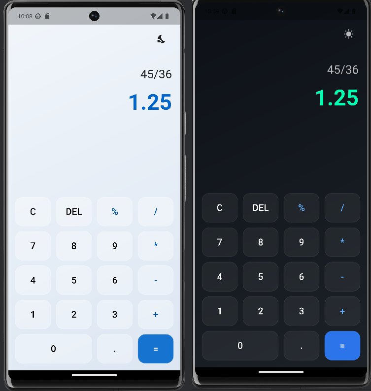

# calculatorMini

A sleek and modern calculator app built with **Flutter** featuring:
- **Glassmorphism design** for a premium look
- **Light & Dark mode** toggle
- Smooth animations and responsive layout
- Modern operator and number button styling

---

## 🚀 Features
- **Glassmorphism UI** — Soft blur effects with semi-transparent buttons
- **Theme Toggle** — Switch between light and dark modes instantly
- **Responsive Layout** — Looks great on different screen sizes
- **Basic Calculator Functions** — Add, subtract, multiply, divide, and percentage

---

## 🛠 Tech Stack
- **Framework:** [Flutter](https://flutter.dev/)
- **Language:** Dart
- **Packages Used:**  
  - [`math_expressions`](https://pub.dev/packages/math_expressions) – for parsing & evaluating math operations

---

## 📂 Project Structure
